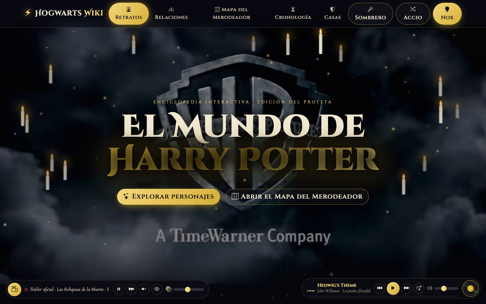
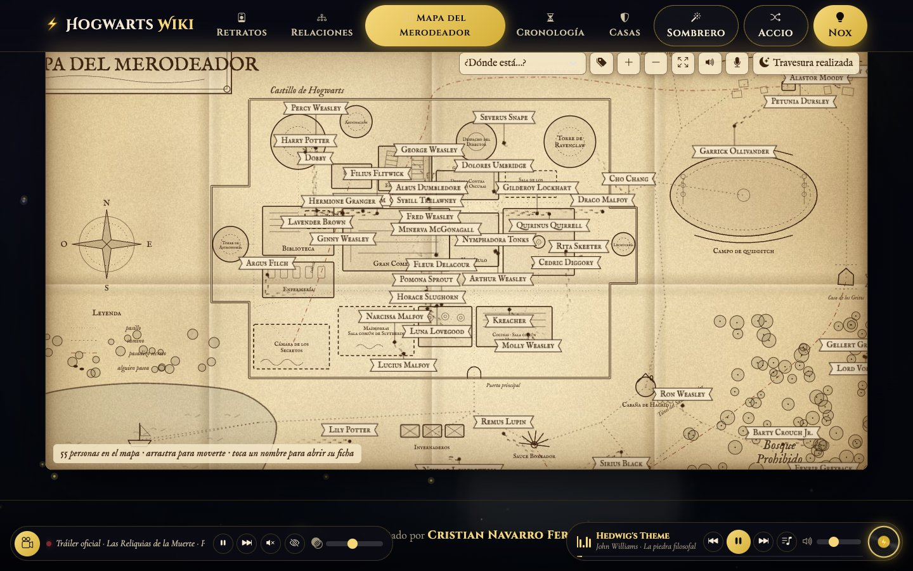
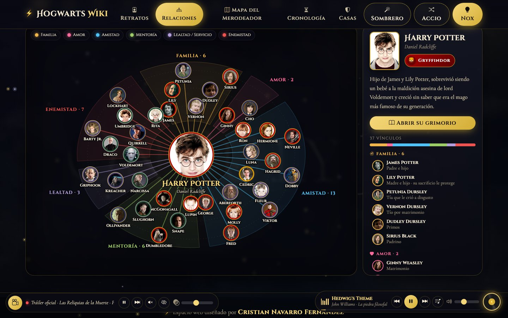
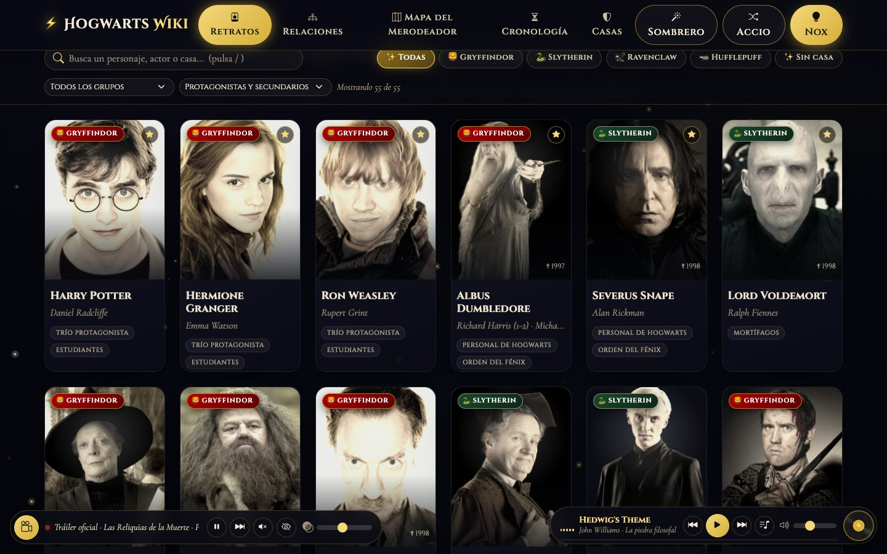

# ⚡ Hogwarts Wiki · Enciclopedia del Mundo Mágico

**🔗 Web publicada: https://cnfnavarro.github.io/hogwarts-wiki/**



| Mapa del Merodeador | Constelación de relaciones |
|---|---|
|  |  |



Wiki interactiva de una sola página sobre el mundo de Harry Potter, hecha con **HTML5, CSS3, JavaScript, Bootstrap 5** y **D3.js**.

## Cómo abrirla

**Lo más fácil:** doble clic en **`Abrir Hogwarts Wiki.command`**. Arranca un servidor local en esta carpeta, busca un puerto libre y abre la wiki en el navegador. Para cerrarla, cierra la ventana de Terminal.

Si prefieres hacerlo a mano, **ejecuta el comando dentro de la carpeta del proyecto** (si lo lanzas desde otra carpeta, el navegador mostrará esa carpeta en vez de la wiki):

```bash
cd "Desktop/Mis archivos/Proyecto Harry Potter Wiki"
python3 -m http.server 5173 --bind 127.0.0.1
```

y abre <http://localhost:5173>. No abras el `index.html` con doble clic: YouTube no funciona desde `file://`.

## Secciones

| Sección | Descripción |
|---|---|
| **Portada** | Tráileres oficiales de fondo, bien visibles; al bajar se atenúan para que el contenido se lea. |
| **Retratos** | 55 personajes con su imagen **tal y como aparecen en las películas**. Los retratos «se mueven» como los cuadros de Hogwarts y se inclinan en 3D. |
| **Grimorio** | Ficha completa de cada personaje: actor, datos, historia, cronología y mini-mapa de relaciones. Navega con ← →. |
| **Relaciones** | «Constelación de relaciones»: un personaje en el centro y sus vínculos ordenados por tipo (familia, amor, amistad, mentoría, lealtad, enemistad). Pulsa un retrato para viajar a su constelación. |
| **Mapa del Merodeador** | Mapa de Hogwarts, sus terrenos y Hogsmeade por el que se mueven los 55 personajes dejando huellas. Al entrar se abre el pergamino y suena la frase. |
| **Cronología** | De 1899 a 2017. «Ver en el mapa» abre la constelación de los implicados. |
| **Casas** | Las cuatro casas; al elegir una, la wiki se tiñe de sus colores. |
| **Gramola (BSO)** | Banda sonora oficial (WaterTower Music) desde el vinilo ⚡ de la esquina inferior derecha. |

## El Mapa del Merodeador

- Arrastra para moverte; **Ctrl/⌘ + rueda** (o pellizcando) para hacer zoom.
- **¿Dónde está…?** sigue a un personaje con la cámara.
- Toca un nombre para abrir su grimorio.
- **Travesura realizada** borra la tinta y cierra el mapa.

### La frase «Juro solemnemente que mis intenciones no son buenas»

Warner no tiene publicada en ningún canal oficial la escena doblada al castellano, así que el audio del doblaje tienes que ponerlo tú (por ejemplo, un recorte de tu DVD o Blu-ray). Orden en que se reproduce:

1. **Tu audio**: botón del micrófono 🎙️ en la barra del mapa → «Usar mi audio del doblaje…». Se guarda en el navegador (hasta 8 MB).
2. **Archivo del proyecto**: copia el recorte como `assets/audio/juro-solemnemente.mp3`.
3. **Voz en castellano** del navegador (lo que suena por defecto).
4. **Clip original en inglés** del canal oficial de Harry Potter, solo si pones `usarClipOriginal: true` en `CLIP_FRASE` (`js/data.js`).

## Extras

- **Sombrero Seleccionador**, **Accio** (personaje al azar) y modo **Lumos / Nox**.
- Escribir «juro solemnemente…» en el buscador abre el Mapa del Merodeador.
- Enlaces directos a fichas: `#personaje/snape`.

## Estructura

```
index.html          Maquetación (Bootstrap) y capas de fondo
css/styles.css      Tema, animaciones y diseño responsive
js/data.js          Personajes, relaciones, cronología, retratos, tráileres, BSO y frase del mapa
js/app.js           Retratos, grimorio, constelación de relaciones, vídeo, música y efectos
js/merodeador.js    Mapa del Merodeador (mapa SVG + personajes en canvas)
assets/audio/       Aquí puedes dejar el audio del doblaje de la frase
```

Para añadir un personaje: un objeto en `PERSONAJES`, su página de la Harry Potter Wiki en `FOTOS_PELICULA`, sus vínculos en `RELACIONES` y, si quieres que pasee por el mapa, sus lugares en `RUTINAS` (`js/merodeador.js`).

## Créditos

Proyecto de fans sin ánimo de lucro. Harry Potter pertenece a J. K. Rowling y Warner Bros. Imágenes de los personajes vía Harry Potter Wiki (Fandom); tráileres, clips y banda sonora oficiales embebidos desde YouTube.

Espacio web diseñado por **Cristian Navarro Fernández**.
